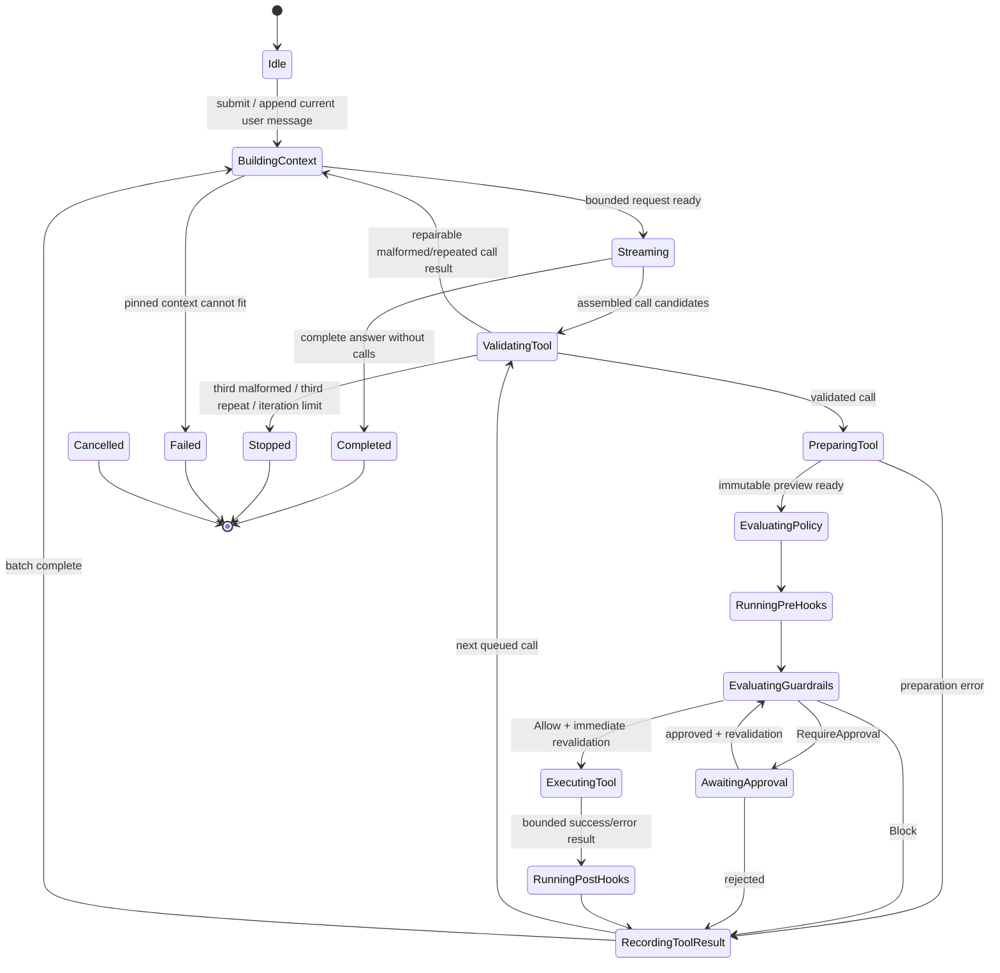

# Agent execution state machine

Status: **Proposed**. `Agent` is a contract; `AgentLoop` is not implemented in this phase.

## States

Every nonterminal state can transition to Cancelled on cancellation and Failed on an unexpected infrastructure error. Expected tool errors are recorded and fed back, rather than failing the whole run. No tools execute after a terminal state. A length-limited answer emits ResponseCompleted with `Length` and ends visibly; incomplete provider call fragments never execute.

## Run algorithm

1. Reject a concurrent submission. Capture run settings, selected root, active skill, model capabilities, hook config and available tools. Verify the model exists. Without supported tools, use an empty definition list and chat-only mode.
2. Load conversation; append current user message exactly once. Load only the explicitly selected skill. Attach only host-resolved selections/files the user requested.
3. ContextBuilder applies the budget, including definitions and current-step tool results. Save its bounded conversation. Emit ContextUpdated. Overflow ends with a clear ErrorOccurred and no provider request.
4. Start a new assistant message/step, emit ResponseStarted, stream text/thinking/usage. Store text but never thinking. The provider assembles complete candidates before Core validates them. Persist one assistant message plus validated tool calls when the stream ends.
5. With no calls, finalize and compact/rebound storage, return Completed. Otherwise process calls in provider order, **serially**. There is no speculative execution, concurrent writing or repeated batch replay.
6. Count each candidate attempt against MaxToolIterations (default 10), including malformed/duplicate attempts. Resolve/validate the call. Tool calls from a chat-only model are refused. Unknown names or invalid schema are structured errors, not executions. Known but mode-disallowed tools are blocked through the policy pipeline.
7. `Tool.prepare` computes normalized targets, command assessment and preview without mutation. A failed edit match/read/schema/version precondition produces a structured tool result. Preparation must use WorkspacePathGuard before any read, including preview reads.
8. Compute dynamic risk and baseline PermissionPolicy. Run all BeforeToolExecution hooks with immutable, bounded input. Merge veto/failure into Block. Run all guardrails after hooks, even if already blocked; combine only by strictness.
9. Block returns a bounded blocked result, no tool execution. RequireApproval emits ToolAwaitingApproval and awaits ApprovalPort. Reject returns Denied. AllowOnce binds the exact preparation key. A stale ID/key is rejected without resuming the tool.
10. After approval, re-resolve paths/revalidate editor versions and re-evaluate guardrails immediately before execution. Do not rerun pre-hooks solely because a dialog was open. If the preparation changed, discard approval, reprepare and run the complete safety pipeline again. A still-applicable RequireApproval is satisfied only by the same bound approval; Block always prevents execution.
11. Execute once, emit ToolStarted/ToolCompleted, run AfterToolExecution hooks and report their observations/failures. Post-hooks run on actual execution outcomes, including a returned tool error. They do not run on denied/blocked/preparation failures. Cancellation may terminate post-hooks; it never resurrects an execution.
12. Append bounded tool results paired with their assistant call. Continue through queued calls, then build the next request. Results of this current step retain their identities and receive a fair share of the remaining token budget. No result is silently removed.

Agent orchestration does not branch on built-in versus MCP. Adapters emit additional lifecycle metadata for observability through the same sink. Event sinks cannot return permission decisions and must isolate their own presentation/logging failures from Core.

## Small-model repair and repeats

| Condition                             | First occurrence                            | Second consecutive occurrence                 | Third consecutive occurrence |
| ------------------------------------- | ------------------------------------------- | --------------------------------------------- | ---------------------------- |
| Malformed/unknown/schema-invalid call | Structured diagnostic; repair opportunity 1 | Diagnostic; repair opportunity 2              | Stop: MalformedToolCall      |
| Same name + canonical arguments       | Normal pipeline; execute at most once       | No execution; result-already-in-context error | Stop: RepeatedToolCall       |

Canonical fingerprints use sorted object keys, preserve array order/types and exclude provider-generated IDs. Different key order is not a new invocation. Repeat tracking spans model continuations and adjacent calls in one batch, resets on a different valid fingerprint, and resets at a new user turn. A denial/block still establishes that fingerprint, so the model cannot repeatedly prompt for the same approval.

Malformed repair is tracked as a logical pending repair, not by a provider call ID the model can change. At most two repair requests follow an invalid attempt. The allowance resets after a valid nonrepeated call/normal answer, not just because the model changes the unknown tool name. Every repair counts toward the shared hard tool-attempt limit. A remaining valid call in a batch may be processed, but does not retroactively turn an invalid candidate into a valid call.

Malformed candidates are never serialized as native assistant tool calls with invalid arguments. Instead, add a bounded user-data diagnostic instructing the provider to repair, while normal valid assistant/tool pairs remain intact. Provider framing corruption that cannot be localized to a tool candidate is an ErrorOccurred and Failed outcome. Do not ask the model to repair transport bytes.

Ten attempted calls are the maximum; an eleventh is refused before preparation/execution. After the tenth result, one bounded continuation can return an ordinary final answer; if it requests another call, stop with IterationLimit. This avoids counting a harmless final prose response as tool execution.

## Cancellation and races

Stop aborts fetch, rejects pending approval, terminates a running command tree, cancels MCP calls where supported, marks streamed text partial and emits GenerationCancelled. Already-applied edits remain; cancellation is not rollback. The host discards later events for the old run. No unresolved calls are replayed on the next turn; cancelled pending valid calls receive a bounded cancellation result so native call/result framing remains complete.

Folder switching or NewConversation cancels before disposing run resources. Settings changes do not affect the captured run. Guardrail failures fail closed. Hook programs are trusted executable configuration, so a pre-hook can itself have side effects even when the requested tool will be blocked; that accepted risk is explicit in ADR 008.
