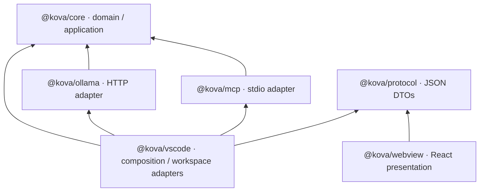

# Architecture baseline

Status: **Accepted with [review amendments](REVIEW-CHANGES.md), 2026-09-30.** This delivers specification §41. The approved boundaries are implemented; see IMPLEMENTATION.md for acceptance evidence.

## Dependency direction



Arrows denote imports/dependencies. Core imports only Core. Protocol owns self-contained DTOs, imports nothing from Core, and contains no classes, functions or behavioral interfaces. Host maps between the two. Webview imports only Protocol, its UI libraries and shared PNG branding assets. Ollama and MCP cannot import one another or VS Code. VS Code is the only composition root. Root tooling is not part of the runtime graph.

The one addition to the suggested repository is `packages/protocol`, justified by the host/UI boundary. Filesystem, process and VS Code tool adapters stay in `packages/vscode`; a separate generic infrastructure package is unnecessary at this size. No runtime dependency is installed during architecture review.

## Repository map

The runtime tree follows these boundaries:

```text
kova/
├── packages/
│   ├── core/src/
│   │   ├── common/          CancellationToken, Disposable, JsonValue
│   │   ├── agents/          Agent, AgentRequest, AgentEvent, AgentState, AgentMode
│   │   │                   ChatAgent
│   │   ├── providers/       LlmProvider, ChatRequest, ChatMessage, ChatEvent
│   │   ├── models/          ModelCatalog, ModelInfo
│   │   ├── conversations/   ConversationRepository, ConversationCompactor, summaries
│   │   ├── context/         ContextBuilder, TokenCounter, attachments, usage and result DTOs
│   │   ├── tools/           Tool, ToolRegistry, ToolInputValidator, previews, calls and results
│   │   ├── skills/          Skill, SkillRepository, SkillLoader
│   │   ├── permissions/     policies, risks, approvals, guardrail ports
│   │   ├── hooks/           Hook, HookPipeline, lifecycle/configuration DTOs
│   │   ├── workspace/       reader, writer, search, path guard and Git ports
│   │   ├── processes/       ProcessRunner
│   │   └── mcp/             McpClient, stdio configuration DTOs
│   ├── ollama/src/          OllamaLlmProvider, OllamaModelCatalog
│   ├── mcp/src/             StdioMcpClient, McpTool
│   ├── vscode/src/
│   │   ├── extension/       extension activation, ChatSession
│   │   ├── adapters/        VsCodeWorkspaceReader, VsCodeWorkspaceWriter,
│   │   │                           NodeWorkspaceSearch, NodeWorkspacePathGuard,
│   │   │                           NodeProcessRunner, WorkspaceConfigurationLoader,
│   │   │                           CommandHook, WorkspaceRuntime
│   │   ├── tools/           ReadFileTool, ListDirectoryTool, SearchFilesTool,
│   │   │                           GetGitDiffTool, WriteFileTool, EditFileTool, RunCommandTool
│   │   ├── skills/          WorkspaceSkillRepository
│   │   ├── integrations/    ErsGuardrailAdapter
│   │   └── webview/         KovaViewProvider, validated message router, event projection
│   └── protocol/src/        WebviewMessage, HostMessage, SessionSnapshot,
│                           PresentationEvent, ApprovalView
├── webview/src/             components/, state/, messaging/
├── tests/
│   ├── architecture/        package graph, imports, code organization, Core isolation
│   ├── contracts/           compile-time protocol and capability assertions
│   ├── unit/               isolated behavior tests
│   ├── runtime/            policy, hooks, tool continuation, workspace and MCP tests
│   └── smoke/              actual Ollama, VS Code and ERS checks
├── examples/               review skill, hooks, MCP configs, ERS teaching walkthrough
├── docs/                   architecture, ADRs, original specification, review, milestones
└── .github/workflows/ci.yml
```

Each public class/behavioral interface lives alone in its file. Cohesive DTOs/unions may share a file. Interfaces and implementations have separate files. Contracts use readonly JSON DTOs, ES imports with `.js` suffixes, strict typechecking and no ambient Core Node/DOM types.

## Core contracts and ownership

| Contract                                                                | Responsibility                                                       | Implementation/owner                     |
| ----------------------------------------------------------------------- | -------------------------------------------------------------------- | ---------------------------------------- |
| `Agent`                                                                 | Run orchestration; emits events, returns terminal outcome            | `ChatAgent` in Core                      |
| `LlmProvider`                                                           | Stream normalized model events                                       | Ollama package                           |
| `ModelCatalog`                                                          | Installed model and capability discovery                             | Ollama package                           |
| `ConversationRepository`                                                | Session-scoped conversation storage                                  | In-memory Core implementation            |
| `ContextBuilder` / `TokenCounter`                                       | Budget a request, compact stored history, estimate framed tokens     | Core                                     |
| `ConversationCompactor`                                                 | Deterministically summarize old complete turns                       | Core                                     |
| `Tool`                                                                  | Read-only preparation and authorized execution                       | Built-in VS Code adapters / MCP adapter  |
| `ToolRegistry`                                                          | Register unique tools; expose mode-appropriate definitions           | Core                                     |
| `ToolInputValidator`                                                    | JSON/schema validation; no model arguments execute before validation | Concrete Core schema validator           |
| `CommandRiskClassifier`                                                 | Dynamic invocation risk; parse command and detect hazards            | Core                                     |
| `PermissionPolicy`                                                      | Mode-specific baseline allow/approval/block                          | Core                                     |
| `HookPipeline` / `Hook`                                                 | Ordered lifecycle observations/vetoes                                | Core pipeline, command adapter           |
| `GuardrailEvaluator` / `Guardrail`                                      | Strictest decision, after hooks, every mode                          | Core; pluggable ERS adapter              |
| `ApprovalPort`                                                          | Await one user decision bound to preview and invocation              | VS Code host                             |
| `WorkspacePathGuard`                                                    | Resolve platform paths and containment                               | VS Code/Node adapter                     |
| `WorkspaceReader` / `WorkspaceWriter` / `WorkspaceSearch` / `GitReader` | Explicit bounded workspace IO                                        | VS Code adapters                         |
| `ProcessRunner`                                                         | Bounded, cancellable process execution after policy                  | VS Code/Node adapter                     |
| `SkillRepository` / `SkillLoader`                                       | Discover metadata, load only selected procedural context             | Workspace adapter / Core loader          |
| `McpClient`                                                             | Start configured stdio servers and return normal tools               | MCP package                              |
| `AgentEventSink`                                                        | Observability channel; no permission authority                       | Host projection + redacted Output logger |

Use interfaces only at real IO/process/model/UI boundaries or for actual test fakes; pure single-implementation policies, compactor and loader are concrete classes. Provider/SDK JSON validation libraries are adapters, never Core dependencies. File tools remain in infrastructure because they perform platform IO through workspace ports; policy and orchestration remain in Core. The Core knows origin metadata for context accounting/observability, but execution is always through `Tool`, without origin-specific branches.

## Composition and lifetime

The extension activates on opening Kova (no hidden eager repository ingestion). One selected workspace folder is the active root, including in multi-root workspaces. No folder means chat-only; tools, skills, MCP and hooks stay disabled. The selected folder is fixed for the extension session; reopening a different folder restarts the host session. Multi-root selection uses the active editor folder at activation, falling back to the first folder. Workspace state cannot cross roots.

One run at a time per selected workspace. A busy host rejects a second submission. A run captures mode, model, active skill, context settings, configuration and tool definitions. Changes take effect on the next run, and cannot grant additional permissions during an existing run. New chat cancels the old run, removes its pending approval and starts empty history. Conversation storage lasts until extension shutdown; explicit new chat clears the active conversation.

MCP initialization and hook configuration loading happen when a workspace session is initialized. Stdio MCP commands start without an extra trust dialog. Hook programs run at their configured lifecycle event, not merely because the configuration is read. At each idle run start, compare MCP/hook config content hashes. Reload changed hooks, restart only changed MCP servers, stop removed ones and emit ConfigurationReloaded. Never reload midway through a run. Agent writes to executable configs remain protected.

Adapters translate cancellation to fetch abort, VS Code tokens, pending-approval rejection and process-tree termination. Disposal terminates MCP processes and process resources. Core receives only `CancellationToken`. Cancellation callbacks must also fire for already-cancelled tokens; `throwIfCancellationRequested()` uses one recognizable cancellation error, distinguished from failure by the adapter/Core boundary.

## Application flow and UI

The host translates validated UI intent into `AgentRequest`, then calls `Agent.run`. The Agent retrieves conversation, loads selected skill, builds bounded context, streams the provider, resolves tool calls through the safety pipeline, records bounded results and continues. Tool execution is serial in v1. The host projects `AgentEvent` into safe protocol DTOs; React renders conversation, thinking, context cost, approvals and an activity list.

There is one conversation panel, with prompt, send/stop, model selector, four-mode picker and context meter. Tool definition token cost is separate. Skills, tools, MCP, hooks, guardrails and errors are visible in expandable activity rows. There is no dashboard and no React-owned business state. Diff preview uses host-side virtual documents and VS Code's diff editor.

Details: [state machine](AGENT-LOOP.md), [protocol](PROTOCOL.md), [context](CONTEXT.md), [policy](TOOLS-AND-POLICY.md), [providers](PROVIDERS.md), [integrations](INTEGRATIONS.md), [testing](TESTING.md).
